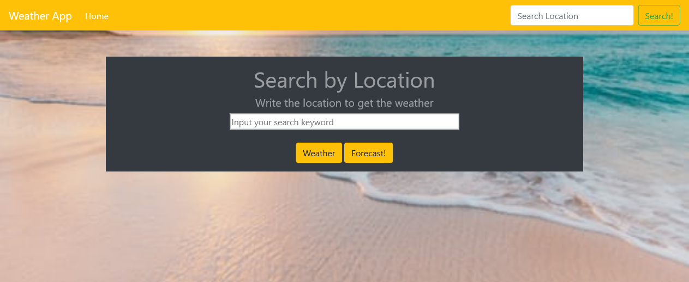
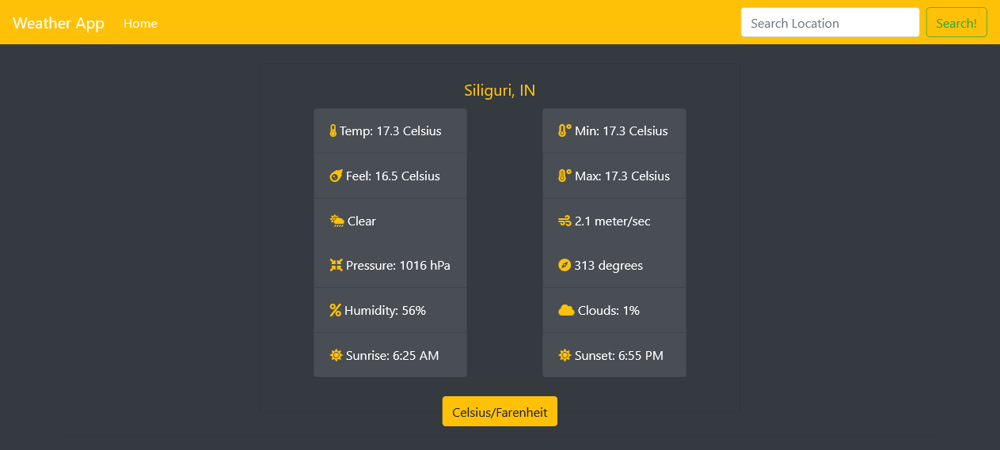
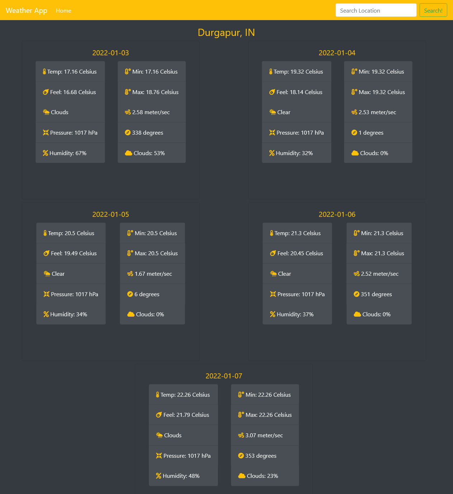

# WeatherApp

>  A weather app that pulls from the OpenWeatherMap API to allow users to search for and view the forecast in cities worldwide. Built with JavaScript.

Landing Page:

Actual Weather:

5-Day Forecast:

Additional description about the project and its features.

## Built With

- HTML 
- CSS
- JAVASCRIPT
- NPM
- WEBPACK
- BOOTSTRAP
- GITHUB ACTIONS

## Live Demo

[Live Demo Link](  ) :point_left:

## Getting Started
- Follow the live demo link and enjoy the site.

### Usage
- To get a local copy up and running follow these simple example steps.

Clone the repository unto your local machine cd to the folder.

### Prerequisites

- A modern browser, up to date.  :muscle:

### Run tests

- There is no automated tests for this project.

## Future features

- Add extra functionality and a contact page.

## Author

👤 Saksham Pandey
- Github: [@Saksham21s](https://github.com/Saksham21s) 
- Instagram: [@Saksham_pandey07k](https://twitter.com/SamirPaulb) 
- Linkedin: [Sakshampandey](https://instagram.com/saksham_pandey07k?igshid=OGQ2MjdiOTE) 

## Show your support

Give a ⭐️ if you like this project!

